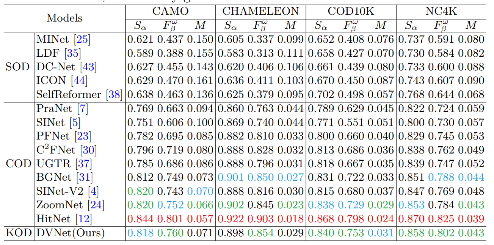
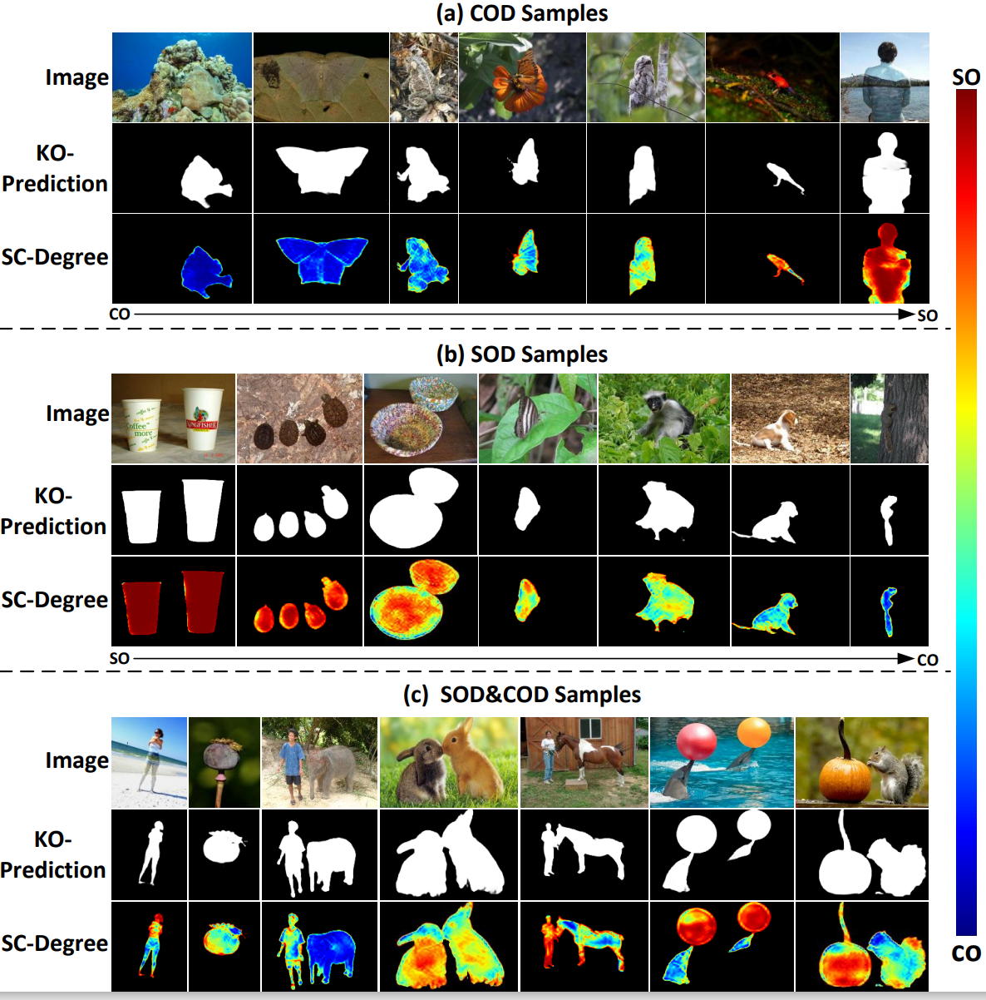

# KOD-DVNet 

Key Object Detection: Unifying Salient and Camouflaged Object Detection into One Task

# Requirements
* Python 3.8.3  
* Torch 1.10.0  
* Torchvision 0.10.0  
* Cuda 11.1  

## Results
1. Performance comparison with benchmark SOD models. The best scores were marked red, followed by green and blue.

2. Performance comparison with benchmark COD models. The best scores were marked red, followed by green and blue.

3. Visualization of the predicted results are presented in three groups.

## More details will be released later...